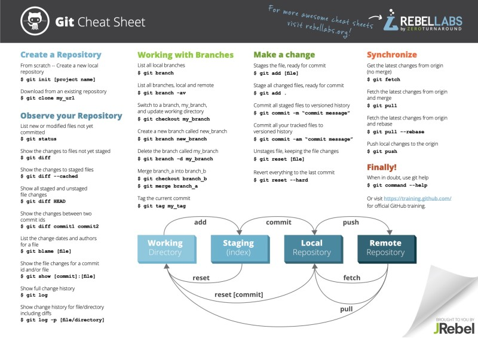

    #TIL

    ## 리눅스 명령어
   
    1. ls
     > list(목록)

    2. cd
      change directory (작업 경로 변경)
    3. rm
      remove(파일 삭제)
    4. mkdir   
       make directory(작업목록 생성)
    5. rmdir 
       remove directory(작업목록 삭제)

    6. touch
       파일생성

    7. cat
       파일내용 출력

    ## git
    1. init
        git 생성
    2. add <파일명>
        staging area에 이동
    3. commit -m<메시지>                    
       Repository로 이동
    4. push <원격저장소><브렌치>
        원격(GitHub)으로 이동
    5. pull <원격저장소명><브렌치>
        원격에서 로컬로 복사
    6. clone <원격저장소><브렌치>
        원격에서 로컬로 복재
    
    7. status 
        staging Area의 상태

    8. log
       repository의 상태
    
    9.git commit --amend
       바로 전commit과 staging Area의 Merge을 할때
    10. git restore --staged <파일명> 
         Staging Area의 파일을 Working 
         Directory로 가져옴

    

